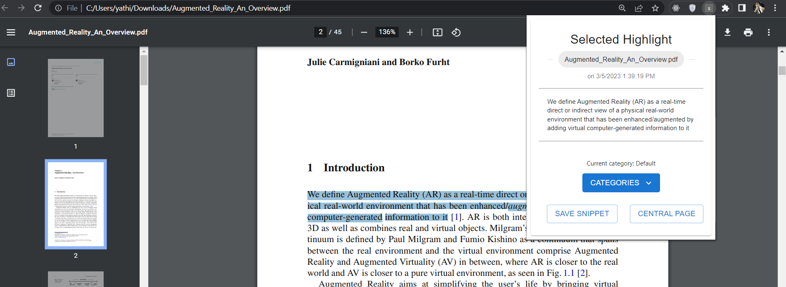

# Snipd 🔫

## Problem Statement / Motivation

In today's digital age, we have access to vast amounts of information that are available in the form of PDFs, articles, and web pages. However, keeping track of important information buried within lengthy documents can be challenging. Many people often read and highlight important lines and quotes while reading PDFs or articles online. However, as the number of highlights increases, it can become cluttered and challenging to keep track of them. 

#### Real life scenario
 > We were preparing for our Semester end Exams and studying from multiple sources like PDFs, Websites, etc. To make notes, We used to highlight useful information and then write them down in our notebooks. It's a very tedious process, but we have to do it because it's easier to revise if everything is in one place. What if there was an app that stores all the highlights from different sources in a centralized system 🤔. 

There is currently no centralized system that stores highlights, links, images, and other information from various sources in one place. Therefore, there is a need for a platform that can compile and organize these highlights into a single page, making it easier for users to navigate through their highlighted content. The solution should be designed to improve productivity and efficiency for individuals who rely on reading and extracting essential information from various sources.

## _Annoting and storing text, images and links made easier_

Snipd is a note collecting browser extension which supports highlighting of texts from PDFs/websites, images by URL, links and notes. Once a collection is done. You will be able to manage all the collections on a dedicated central page - where all the snippets are stored. Additionally, it can be 
exported via PDF.

## Features

- Save any form of text including PDF files.
- Cross platform extension.
- Categorise them and arrange them.
- Search through the saved snippets.
- Records all the other meta data about the snippet that might come handy later.
- Export documents as PDF

## Use cases

- Useful while studying and making notes when you're having multiple resources to read from.
- Storing interesting quotes or dialogues while reading.
- Easily arrange the snippets based on their categories so it becomes personalised.
- Useful meta data in the save snippets will help you revisit the files or pages from where you initially highlighted the text/image.

## How to use

- The first step would be to highlight the required text from the pdf/website.
For images and links, an option to add the selected item to collection is available.
- After selecting the text, click on the extension button and a pop-up will appear with the following options.

- On clicking the central page, you will be led to the page where all the text,images,links and notes are saved.

## Timeline of the project 

## License

MIT

**Free Software, Hell Yeah!**
